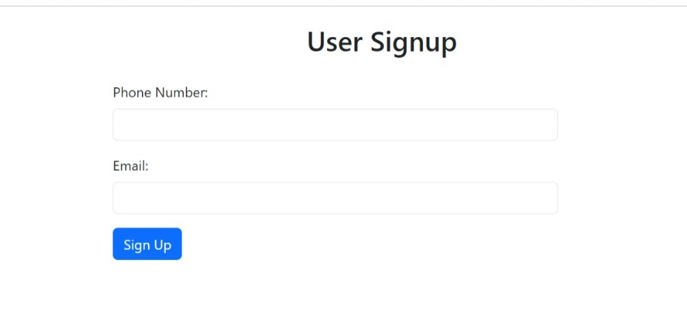
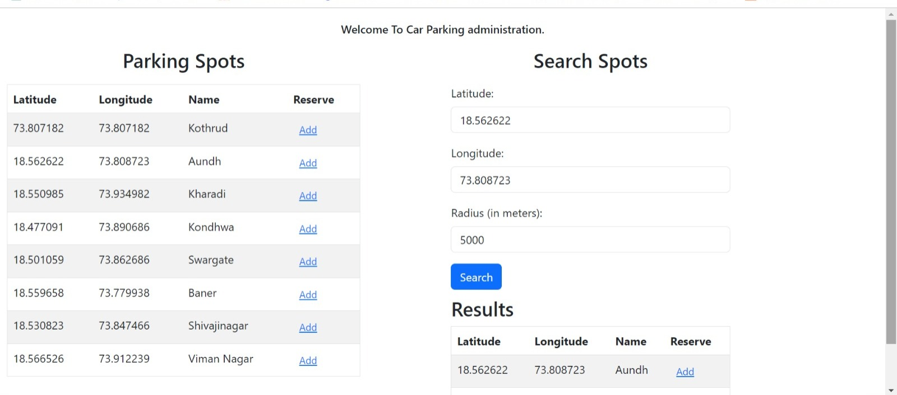
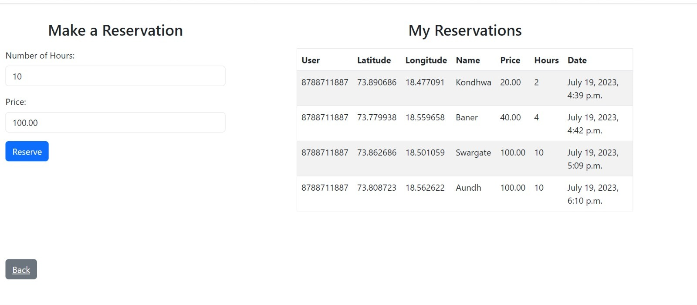

# Car Parking Administration System

The Car Parking Administration System is a web application built with Django that allows users to manage car parking spots and make reservations.
Also it has REST Api's for the frontend application(Android, React, Angular, etc.).

## Features

- User registration
- Viewing available parking spots and their coordinates
- Searching for nearby parking spots based on latitude, longitude, and radius
- Making reservations by specifying the number of hours
- Viewing existing reservations

## Installation

1. Clone the repository:

git clone https://gitlab.com/first5060729/car-parking-administration.git

2. Navigate to the project directory:

- cd car_parking_administration
- create the virtual environment
  python -m venv venv
- Activate the virtual environment:
  venv\Scripts\activate

3. Install the project dependencies:

pip install -r requirements.txt

4. Apply database migrations:

python manage.py migrate

5. Start the development server:
python manage.py runserver

6. Access the application at `http://localhost:8000/parking/signup/`.

## Usage

- Sign up using your phone number or email.

- View available parking spots and their coordinates and search using latitude, longitude, and radius.

- Make a reservation by providing the number of hours and View your existing reservations.

# Parking Reservation.postman_collection.json.

1) Sign up using your phone number or email. (POST)
2) View available parking spots and their coordinates (GET)
3) Search using latitude, longitude, and radius. (POST)
4) Make a reservation by providing the number of hours, price,user,parking spot (POST)
5) List of existing reservations. (GET)

